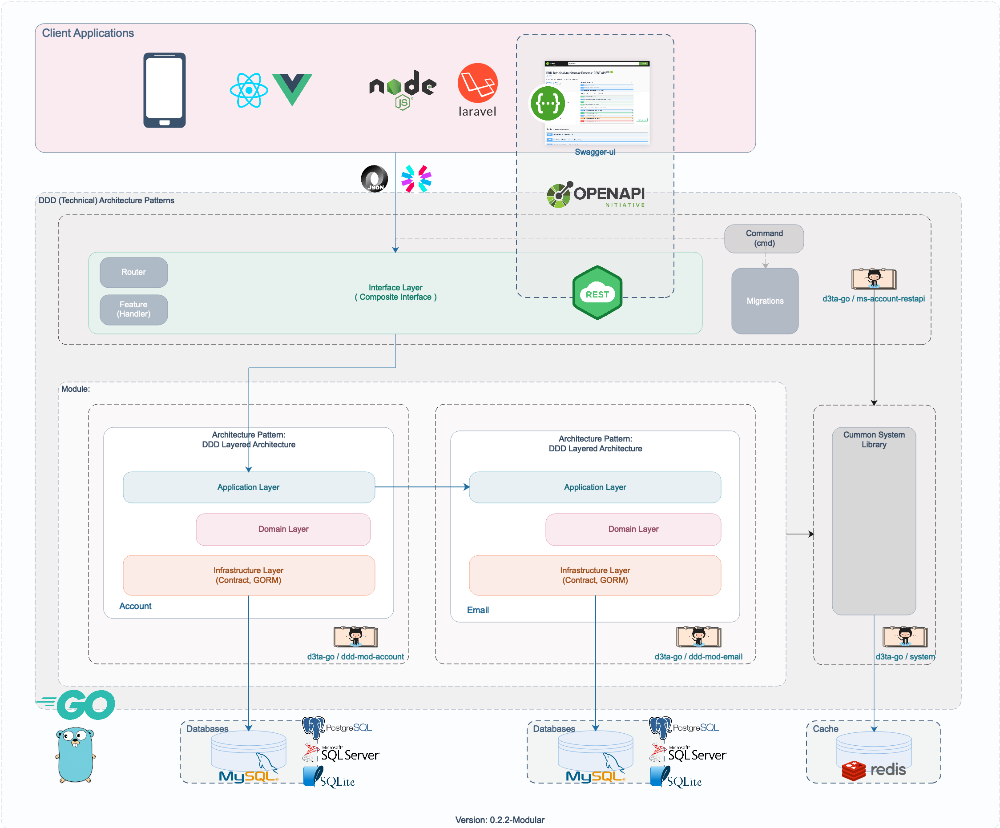
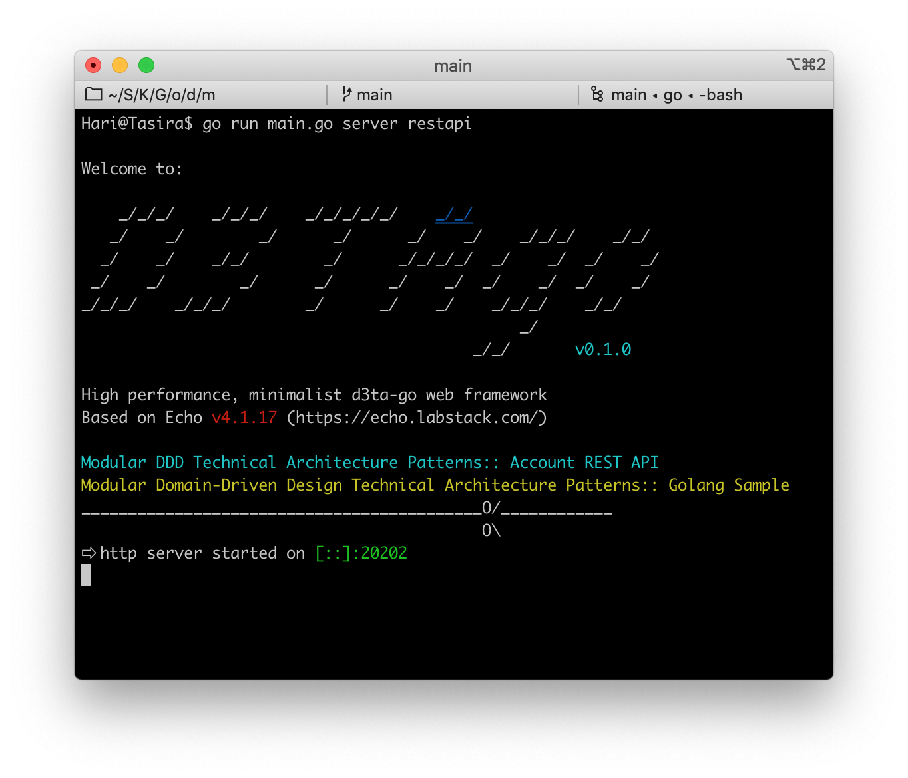
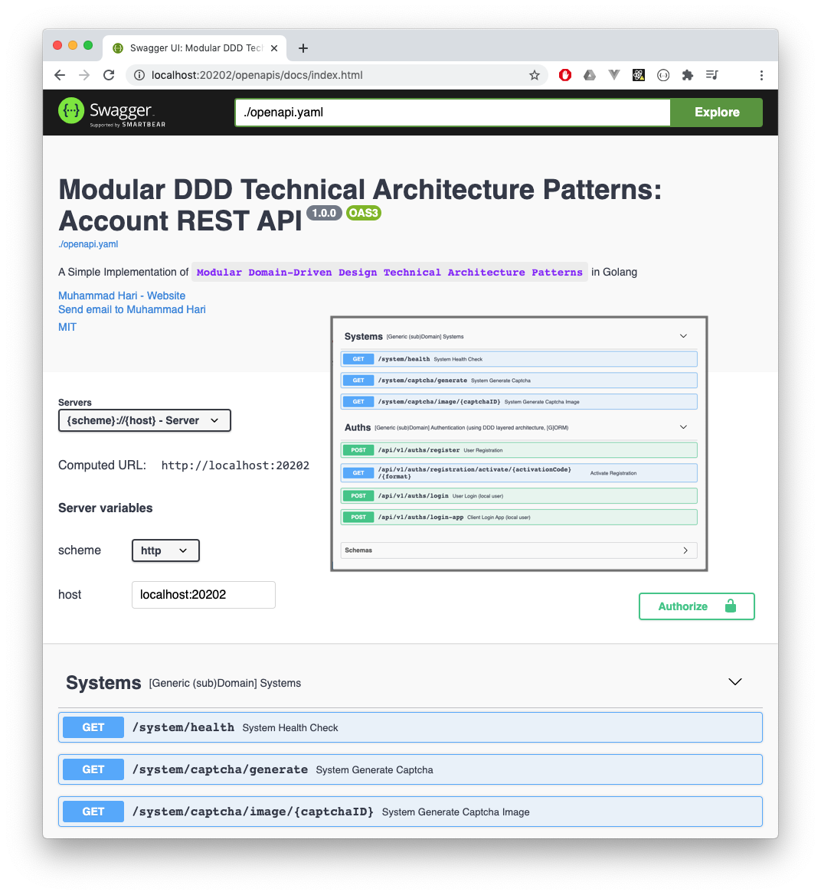

# ms-account-restapi

MicroService Interface/Presentation App: Account RestAPI

As a part of `Simple Implementation of Modular DDD Technical Architecture Patterns in Go`.

## Diagram v 0.2.2-Modular



## Components

A. Interface Layer (MicroService)

1. Microservice: Account REST API - using Echo Framework [ [d3ta-go/ms-account-restapi](https://github.com/d3ta-go/ms-account-restapi) ]

B. DDD Modules:

1. Account (Authentication) - using DDD Layered Architecture (Contract, GORM) [ [d3ta-go/ddd-mod-account](https://github.com/d3ta-go/ddd-mod-account) ]
2. Email (Indirect) - using DDD Layered Architecture (Contract, GORM, SMTP) [ [d3ta-go/ddd-mod-email](https://github.com/d3ta-go/ddd-mod-email) ]

C. Common System Libraries [ [d3ta-go/system](https://github.com/d3ta-go/system) ]:

1. Configuration - using yaml
2. Identity & Securities - using JWT, Casbin (RBAC)
3. Initializer
4. Email Sender - using SMTP
5. Handler
6. Migrations
7. Utils

D. Databases

1. MySQL (tested)
2. PostgreSQL (untested)
3. SQLServer (untested)
4. SQLite3 (untested)

E. Persistent Caches

1. Session/Token/JWT Cache (Redis, File, DB, etc) [tested: Redis]

F. Messaging [to-do]

G. Logs [to-do]

### Development

1. Clone

```shell
$ git clone https://github.com/d3ta-go/ms-account-restapi.git
```

2. Setup

```
a. copy `conf/config-sample.yaml` to `conf/config.yaml`
b. copy `conf/data/test-data-sample.yaml` to `conf/data/test-data.yaml`
c. setup your dependencies/requirements (e.g: database, redis, smtp, etc.)
```

3. Runing on Development Stage

```shell
$ cd ms-account-restapi
$ go run main.go db migrate
$ go run main.go server restapi
```

4. Build

```shell
$ cd ms-account-restapi
$ go build
$ ./ms-account-restapi db migrate
$ ./ms-account-restapi server restapi
```

5. Distribution (binary)

Binary distribution (OS-arch):

- darwin-amd64
- linux-amd64
- linux-386
- windows-amd64
- windows-386

```shell
$ cd ms-account-restapi
$ sh build.dist.sh
$ cd dist/[OS-arch]/
$ ./ms-account-restapi db migrate
$ ./ms-account-restapi server restapi
```

**RESTAPI (console):**



**Swagger UI (openapis docs):**

URL: http://localhost:20202/openapis/docs/index.html



**Related Domain/Repositories:**

1. DDD Module: Account (Generic Subdomain) - [d3ta-go/ddd-mod-account](https://github.com/d3ta-go/ddd-mod-account)
2. DDD Module (Indirect): Email (Generic Subdomain) - [d3ta-go/ddd-mod-email](https://github.com/d3ta-go/ddd-mod-email)
3. Common System Libraries - [d3ta-go/system](https://github.com/d3ta-go/system)

**Online Demo:\***

> Work in progress!

**References:**

1. [Book] Domain-Driven Design: Tackling Complexity in the Heart of Software 1st Edition (Eric Evans, 2004)

2. [Book] Patterns, Principles, and Practices of Domain-Driven Design (Scott Millett & Nick Tune, 2015)

**Team & Maintainer:**

1. Muhammad Hari (https://www.linkedin.com/in/muharihar/)
